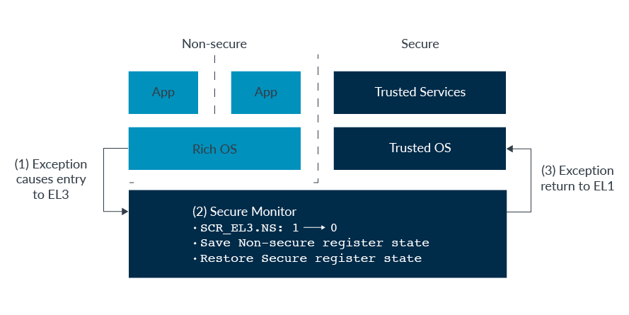

## 개요

- 참석자: 김상윤, 김정근, 김지엽, 김형준, 박준은, 임창수, 정홍관, 홍은비
- 진도: <코드로 알아보는 ARM 리눅스 커널 (2판)> 1.3 익셉션 핸들링
- 결정사항: <코드로 알아보는 ARM 리눅스 커널 (2판)> 1장을 먼저보고 프로그래머스 가이드 진입

## 질문 리스트

- 실행상태란? 프로세스 상태 레지스터(PSTATE)에 `nRW` 필드가 실행상태를 나타냄
- ARM v 또는 A의 차이점, ARM Cortex-A,M,R 차이점
  - [ARM Cortex Series](https://yomi-tory.tistory.com/201)
- 범용 레지스터는 커널이 처리해줌

## 추후 조사 리스트

- 리셋 익셉션
- 벡터테이블에대한 추가적 이해 필요
  - 시스템 콜 처리 시 어떻게 처리되나?

## 기타 참조 내용

- [ARM Cortex-A Series Programmer's Guide for ARMv8-A](https://developer.arm.com/documentation/den0024/a/preface)
- [Arm Architecture Reference Manual Armv8, for Armv8-A architecture profile](https://developer.arm.com/documentation/ddi0487/fc/)
- [스터디 Google Docs](https://docs.google.com/document/d/175yC9wAdcX_Eslm8Fzlff-YIDyQr9Jzgt_0zKdcLt5U/edit?usp=sharing)
- VFS : 가상 파일 시스템
- SIMD : Single Instruction Multiple Data
- [ARM 아키텍처](https://ko.wikipedia.org/wiki/ARM_아키텍처)
- [하이퍼 바이저](https://www.redhat.com/ko/topics/virtualization/what-is-a-hypervisor) : 가상머신을 생성하고 구동하는 소프트웨어
- [load-acquire, store-release 인스트럭션](https://developer.arm.com/documentation/dui0802/b/A32-and-T32-Instructions/LDA-and-STL): 왠지 어토믹 오퍼레이션 같은…

1.1.1 익셉션 모델

1.1.2 익셉션 레벨 변경
- [Security in ARMv8-A systems](https://developer.arm.com/documentation/100935/0100/)
  - [How the Secure model works](https://developer.arm.com/documentation/ddi0333/h/programmer-s-model/secure-world-and-non-secure-world-operation-with-trustzone/how-the-secure-model-works)
  - [TrustZone for Armv8-A](https://developer.arm.com/architectures/learn-the-architecture/trustzone-for-armv8-a/single-page)

- secure 모드? 추가 연구 필요
- armv8 - armv7 인셉션 모델 매핑
  - EL0 -> User 모드
  - EL1 -> Supervisor 모드
  - EL2 -> Hypervisor 모드
  - EL3 -> Secure 모드

1.2 ARMv8 레지스터

1.2.1  프로세서 상태 레지스터
- [SPSR (Saved Program Status Register)과 PSTATE (Processor State)](https://gongpd.tistory.com/9)

1.2.2 AArch64 특수 목적 레지스터
- XZR, WZR (Zero register ) : 항상 0이 저장되고 0이 읽히는 레지스터이다.
  - https://m.blog.naver.com/eldkrpdla121/221522612959
  - [Is Zero Register 'zr' in aarch64 essentially ground?](https://stackoverflow.com/questions/52410521/is-zero-register-zr-in-aarch64-essentially-ground)

1.2.3 시스템 레지스터
- [시스템 레지스터](https://developer.arm.com/documentation/den0024/a/armv8-registers/system-registers)
- MSR 시스템레지스터 <- 일반레지스터
- MRS 일반레지스터 <- 시스템레지스터

1.2.4 ABI의 레지스터 사용 규칙
- [ILP32 and LP64 데이터 모델](https://www.ibm.com/support/knowledgecenter/SSLTBW_2.3.0/com.ibm.zos.v2r3.cbcpx01/datatypesize64.htm)

1.3 익셉션 핸들링

- [FIQ Handlers in the ARM Linux Kernel](https://bootlin.com/blog/fiq-handlers-in-the-arm-linux-kernel/)
- [ARM 부트로더 1 - 리셋 예외처리](https://damduc.tistory.com/100)
- [Dispatcher 와 Scheduler 차이](https://www.geeksforgeeks.org/difference-between-dispatcher-and-scheduler/)

1.3.2, 1.3.4 에서 HCR_EL, SCR_EL
- AArch32 register descriptions
  - [Secure Configuration Register](https://developer.arm.com/documentation/ddi0500/j/System-Control/AArch32-register-descriptions/Secure-Configuration-Register)
  - [Hyp Configuration Register](https://developer.arm.com/documentation/ddi0500/j/System-Control/AArch32-register-descriptions/Hyp-Configuration-Register)
  - [RMR_ELn (Reset Management Register)](https://developer.arm.com/documentation/ddi0500/j/System-Control/AArch32-register-descriptions/Reset-Management-Register)

> RR 비트: 콜드 or 윔 결정\
> AA64 비트 : 32비트 or 64비트 결정

1.3.7 GIC (Generic Interrupt Controller)

- [Interrupt Controller: 문c 블로그](http://jake.dothome.co.kr/ic/)