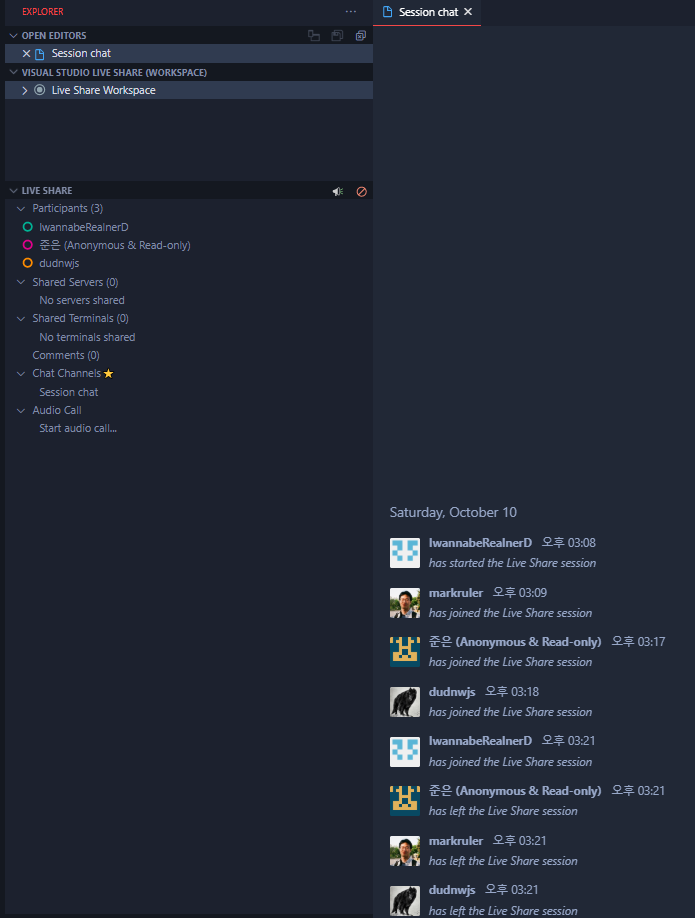

## 개요

- 참석자: 김지엽, 김형준, 박준은, 임창수, 정홍관
- 정리: [정홍관님 노션](https://www.notion.so/2020-09-26-f4d73337cd7a4d47a4615d22da2c4dbd)

## 진행 사항

- Head.s 시작 [v5.9-rc8](https://elixir.bootlin.com/linux/v5.9-rc8/source/arch/arm64/kernel/head.S) → 나중에 LTS 나오면 LTS로 변경해서 분석할 예정

```bash
git clone --depth 1 --single-branch --branch v5.9-rc8 git://git.kernel.org/pub/scm/linux/kernel/git/stable/linux-stable.git
```

- [head.S // SYM_CODE_START_LOCAL(preserve_boot_args)](https://github.com/torvalds/linux/blob/v5.9-rc8/arch/arm64/kernel/head.S#L134)
- 다음주부터 강남에서 오프라인 예정
- VS Code Live Share Extenstion으로 소스코드 실시간 공유해 같이 분석함



## 참고 자료

- head.S
  - [원본 head.S](https://github.com/torvalds/linux/blob/v5.9-rc8/arch/arm64/kernel/head.S)
  - [주석 head.S](./head.S)
  - [문c 블로그: kernel/head.S – ARM64](http://jake.dothome.co.kr/head-64/)
  - <코드로 알아보는 ARM 리눅스 커널 (2판)>

- TEXT_OFFSET이 0x0인 이유
  - [Linux 5.8-rc2 체인지로그](https://lwn.net/Articles/824072/)
  - [arm64: remove TEXT_OFFSET randomization](https://git.kernel.org/pub/scm/linux/kernel/git/arm64/linux.git/commit/?id=751c263bb74fd36b5fc2589d36abc75042336444)
  - [arm64: set TEXT_OFFSET to 0x0 in preparation for removing it entirely](https://www.spinics.net/lists/arm-kernel/msg798878.html)
  - [arm64: Kernel booting and initialisation](https://git.kernel.org/pub/scm/linux/kernel/git/arm64/linux.git/commit/?id=9703d9d7f77ce129621f7d80a844822e2daa7008)

- CONFIG_EFI를 지정하는 위치
  - [FDT & DTB](https://tot0rokr.github.io/kernel/device%20tree/DTBv1/)
  - [EFI Header](http://www.iamroot.org/ldocs/linux.html#sec-7-1)
  - [arm64: efi: add EFI stub](https://git.kernel.org/pub/scm/linux/kernel/git/arm64/linux.git/commit/?id=3c7f255039a2ad6ee1e3890505caf0d029b22e29)
  - [What Is an EFI File?](https://www.lifewire.com/efi-file-2620983)
  - [What Is UEFI? (Unified Extensible Firmware Interface)](https://www.lifewire.com/unified-extensible-firmware-interface-833069)
  - [arm developer 에서 UEFI](https://developer.arm.com/architectures/system-architectures/software-standards/uefi)
  - [Defining the Interface Between the Operating System and Platform Firmware](https://www.intel.com/content/www/us/en/architecture-and-technology/unified-extensible-firmware-interface/efi-homepage-general-technology.html)
  - [linux kernel 문서 UEFI](https://www.kernel.org/doc/html/latest/arm/uefi.html)
  - [Kconfig, defconfig, .config](https://unlocker-sy.tistory.com/119)
  - [MZ Signature](https://wiki.osdev.org/MZ)

- primary_entry -> preserve_boot_args
  - [Assembler Annotations](https://www.kernel.org/doc/html/latest/asm-annotations.html)
  - [linkage: Introduce new macros for assembler symbols](https://git.kernel.org/pub/scm/linux/kernel/git/arm64/linux.git/commit/?id=ffedeeb780dc554eff3d3b16e6a462a26a41d7ec)
  - [globl](https://kldp.org/node/96304)
  - [code alignment (p104)](https://www.intel.com/content/dam/www/public/us/en/documents/manuals/64-ia-32-architectures-optimization-manual.pdf)
  - [arm instructions(b, bl)](https://developer.arm.com/documentation/dui0068/b/arm-instruction-reference/arm-branch-instructions/b-and-bl)

- preserve_boot_args
  - [부트로더(bootloader)](https://www.ionos.com/digitalguide/server/configuration/what-is-a-bootloader/)
  - [preserve_boot_args](https://ammonia3.tistory.com/9)
  - [Primary CPU general-purpose register settings](https://www.kernel.org/doc/Documentation/arm64/booting.txt)
